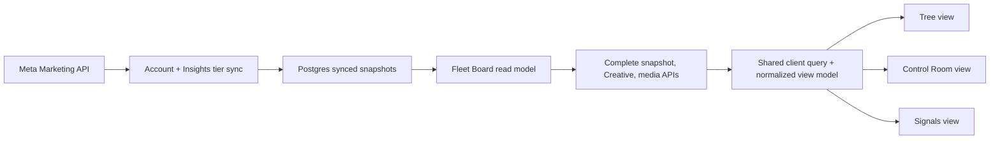

# Meta Fleet Board development plan

**Status:** ready for implementation after the decisions in
[the Fleet Board spec](../specs/meta-fleet-dashboard.md).

**Delivery boundary:** build the Fleet Board core with three production-complete views (Tree, Control
Room, Signals), including the Time Range, reconciliation, scale, and default-depth decisions resolved
during planning. Onboarding, reconnection, Budget display, Creative comparison, persona scoping, and
live agency access remain explicit dependencies or follow-up work; they are not silently implemented
inside this plan.

## 1. Outcome

An authenticated User opens `/` and receives a read-only Fleet Board for the active Agency. One shared
toolbar switches between three URL-addressable views over the same synced Meta data:

- **Tree** — continuous virtualized hierarchy table.
- **Control Room** — virtualized fleet rail plus selected-account hierarchy/detail.
- **Signals** — Needs Attention, Postpay, Active, and Awaiting Data lanes with expandable cards.

Every view must complete the same tasks with the same values: choose a Time Range and Metric Selection,
find attention-worthy accounts, sort/filter roots, inspect freshness, traverse to
an Ad, and inspect its Creative. The implementation is complete only when parity is demonstrated through
the acceptance matrix in §12.

## 2. Current repository state

Do not rebuild what already exists:

- `apps/api/src/db/schema.ts` and migration `0001_flashy_raider.sql` already contain Client, Ad Account,
  Campaign, Ad Set, Ad, Creative, and Ad Insight tables.
- `apps/api/src/meta/client.ts` supports only the Ad Account baseline request and basic retry handling.
- `apps/api/src/sync/account-tier.ts` runs only the baseline Account Tier loop. It does not derive Health,
  sync the hierarchy, sync Insights, or coordinate a second tier.
- `/heartbeat` exists and is authenticated, but only invokes that partial Account Tier loop.
- The fake Meta roster covers raw health combinations only.
- `apps/client/src/routes/index.tsx` is a placeholder. The three existing variants live together in the
  1,100-line `/prototype/fleet-board` route with in-memory data and are not production data flows.
- Existing authorization resolves a Better Auth active organization. Fleet Board routes must reuse that
  membership boundary and call it Agency in Adomata-owned code.

Repository constraints apply throughout: all rendered client text is Ukrainian, React Compiler handles
memoization (no `useMemo`, `useCallback`, `memo`, or directives), no new framework/test runner/ORM, and
every completed slice ends with `pnpm checks`.

## 3. Target architecture

The seams are deliberate:

1. Meta normalization validates untrusted vendor payloads and persists raw signals.
2. Sync orchestration owns cadence, locking, pagination, retry/backoff, completeness, and timestamps.
3. The read model is the only implementation of Health, Needs Attention, Signals Lane, Running, Time
   Range, KPI, mixed-currency/timezone, and rollup rules.
4. API schemas expose presentation-neutral data.
5. The client normalized model owns URL state, complete-snapshot indexing, local expansion/selection, and
   formatting inputs.
6. Each view owns layout and interaction only; it must not recalculate domain values.

## 4. Data model and migration

Generate migrations through the existing Drizzle workflow; do not hand-author production SQL.

### 4.1 Ad Account

Add:

- `timezoneName text` — nullable during rollout, populated from Meta `timezone_name`, then made required
  once all connected/fake accounts have synced.
- Separate Account Tier and Insights Tier attempt/error fields. The current `lastPollAttemptAt` and
  `lastPollError` become Account Tier fields; add Insights Tier equivalents. A successful timestamp must
  never advance on a failed or partial sync.

Stop treating `healthColor` as stored truth. Health Color, Health Reason, Needs Attention, and Signals
Lane are deterministic reads from connection status plus raw Meta fields. Keep the unused column during
the compatibility deployment, remove it in a later cleanup migration after the new API is live.

Normalize Ad Account IDs consistently with ADR 0009. The current fake/client path uses bare numeric IDs
while the ADR example uses `act_…`; real-account validation decides the canonical stored form before the
first production import. Centralize node-path formatting so `act_act_…` is impossible.

### 4.2 Ad Set and result semantics

Add a nullable `resultActionType text` beside `optimizationGoal`. Populate it from the Meta Ad Set payload
when one canonical result action is resolvable; leave it null rather than guessing. Keep attribution
request behavior aligned with the Ad Set's current Ads Manager setting (ADR 0025).

Do not add Client/Agency configuration for CPA in this scope. A row with non-zero spend and mixed or
unresolved result action types returns `cpa = null` plus `cpaReason = mixed_result_types` or
`unresolved_result_type`.

### 4.3 Insights

Introduce `inlineLinkClicks` as the stored additive Clicks component. Preserve the old `clicks` column
during the compatibility migration, write/read the new field, and remove the old column only after
re-syncing the full retained window. Keep Spend as an exact decimal string at TypeScript boundaries and
cast to Postgres numeric for aggregation; do not use floating-point money arithmetic.

Continue storing raw `actions` and `actionValues` arrays as required by ADR 0010. Validate their item
shape at ingestion. Do not add precomputed parent metrics or persisted Provisional/Final flags.

### 4.4 Indexes

Add only indexes justified by the read paths and verify them with `EXPLAIN` against the scale fixture:

- `ad_insight(date, ad_id)` in addition to its existing `(ad_id, date)` primary key if range-first plans
  need it.
- Active-child partial indexes on hierarchy foreign keys where `deleted_at is null` only if Postgres does
  not use the existing parent indexes adequately.

Do not add a preferences table, cached rollup tables, Creative asset-byte table, or analytics schema.

## 5. Domain logic module

Create a small `apps/api/src/fleet-board/` module before routes or UI. Keep functions pure where possible
and give non-trivial rules one focused test file.

### 5.1 Health and operational state

Implement exhaustive mappings for:

- Connection pending/access lost → grey Health with distinct Ukrainian reason keys.
- Meta inactive plus disable reason/status → red.
- Active postpay → yellow, explicitly neutral.
- Active prepay/unreadable prepay → green.
- Needs Attention → red Health or access lost; pending and yellow do not qualify.
- Signals Lane priority → Needs Attention, Postpay, Active, Awaiting Data.

Return reason codes and interpolation data from the API, not final English strings. Render Ukrainian copy
in the client. Unknown future Meta enum values must produce a safe generic reason and structured server
log rather than crashing the entire board.

### 5.2 Time Range and freshness

Implement Today, Last 7 days, and Month to date using each Ad Account's IANA `timezoneName`. Use a clock
argument in tests; cover DST changes, UTC date boundaries, month boundaries, and accounts on opposite
sides of midnight. Keep account-local days; do not re-bucket them into a Client period.

Implement:

- Reconciliation Window: current local day plus 28 complete prior days.
- First-connect start: earlier of local month start or local today minus 28 days.
- Provisional aggregate: any included day lies inside the Reconciliation Window.
- Stale Account Tier: successful refresh older than 10 minutes.
- Stale Insights Tier: successful refresh older than 2 hours.
- Board header freshness: minimum successful timestamp among currently visible accounts.

### 5.3 KPI and rollup rules

Use additive components internally: Spend, Impressions, inline link Clicks, per-action counts, and
purchase value. Derive display values only at the requested row level:

- CTR = summed inline link Clicks / summed Impressions.
- CPA = summed Spend / summed actions only when all spend-contributing descendants resolve to the same
  result action type.
- ROAS = summed attributed purchase value / summed Spend, following Meta attribution.
- Zero denominator → null/em dash, never zero.
- Partial ROAS tracking keeps all Spend in the denominator as specified.
- Running source is Ad `effective_status = ACTIVE`; every parent uses any-active-child-wins.
- Each Ad Account keeps its own currency; the root read model never sums monetary KPIs across Clients.
- Filtering removes nonmatching Ad Accounts before the response is built. Collapse/selection never changes
  account or hierarchy aggregates.

Use one implementation for API rows at every hierarchy level. Tests must include mixed action types,
unresolved types, partial ROAS, zero denominators, soft-deleted historical Ads, mixed currency, filtered
account and hierarchy rollups, and exact decimal arithmetic.

## 6. Meta client and fake surface

Expand `MetaClient` without introducing a second client abstraction.

### 6.1 Requests

Add paginated methods for:

- Ad Account baseline including `timezone_name`.
- Campaigns, Ad Sets, and Ads with names, parent IDs, `effective_status`, objective/optimization data, and
  enough promoted-object data to resolve result action type.
- Ad Creative metadata and all shapes in §6 of the spec.
- Ad-level daily Insights using `time_increment=1`, explicit time range, Spend, Impressions,
  `inline_link_clicks`, `actions`, `action_values`, and required identity fields.
- Image/video metadata refresh used by the media proxy.

Follow Meta's current Ad Set attribution behavior; do not force a global attribution window. Treat Meta
response cursors as untrusted URLs: follow only allowed Meta hosts and never log access tokens or signed
media URLs.

### 6.2 Reliability and throttle data

Keep the existing exponential retry shape for retryable failures, extend parsing to the documented app,
business-use-case, account, and Insights throttle headers, and return throttle observations to the sync
coordinator. Stop issuing new Insights calls while a reported bucket is exhausted; later heartbeat runs
resume due accounts.

Permission/auth failures move connection status to access lost. Rate limits, 5xx, validation failures,
and transient network errors record the relevant tier error but do not destroy prior snapshots or mark
access lost.

### 6.3 Fake roster

Extend the existing network-intercepted fixture roster rather than hand-setting derived results. Include:

- Multiple Clients, currencies, and account timezones.
- Green/yellow/red/pending/access-lost raw health combinations.
- Active/paused Campaign → Ad Set → Ad trees, pagination, disappearance/soft delete, and an empty account.
- Homogeneous, mixed, and unresolved result action types.
- At least 31 daily Insights rows around a month boundary with a revision on a prior day and a row that
  disappears to zero.
- Image, video-thumbnail, carousel, asset-feed, existing-post, and expired-media Creative shapes.
- A generated scale mode for 50 Clients / 150 Ad Accounts and thousands of descendant rows. Keep the
  small deterministic roster as the normal test fixture.

## 7. Sync orchestration

Refactor the current Account Tier loop before adding more work.

### 7.1 Per-tier coordinator

Create a coordinator invoked by `/heartbeat` and non-blockingly by the board root read. It checks due
accounts separately for the 5-minute Account Tier and hourly Insights Tier. Use distinct advisory lock
IDs and a dedicated one-connection SQL client per acquired session lock; perform Meta network I/O outside
a long database transaction and always unlock/close in `finally`.

Process accounts with a small fixed concurrency using a local helper and tests—no queue dependency. Make
the concurrency constants explicit and lower/stop scheduling when throttle headers require it. Each
account commits independently so one failure does not roll back the fleet.

The authenticated heartbeat waits for the work it starts and reports per-tier processed/failed/skipped
counts. The board read starts the same coordinator without awaiting it, logs rejection, and returns the
existing snapshot immediately.

### 7.2 Account Tier

For each due pending/connected account:

1. Fetch baseline and complete hierarchy pages.
2. Validate every page before writing.
3. Upsert baseline, Campaigns, Ad Sets, and Ads in short transactions.
4. Mark missing hierarchy rows soft-deleted only after a complete successful enumeration. Never infer
   deletion from a failed or partial page sequence.
5. Set Account Tier success timestamp only when baseline and operational hierarchy are complete.
6. Preserve previous data and record an error on transient failure; set access lost only on confirmed
   authorization loss.

Creative metadata can sync hourly with Insights because it is not a five-minute operational signal.
Temporary media URLs remain refreshable metadata, not identity.

### 7.3 Insights Tier

For each due connected account:

1. Compute its account-local sync start: first-connect boundary or the Reconciliation Window for an
   established account.
2. Fetch all daily Ad-level pages for that range.
3. Upsert returned rows and clear stored rows inside the successfully fetched range that Meta now omits,
   so a revised value can become zero instead of leaving stale spend/actions behind.
4. Preserve rows older than the fetched range and all soft-deleted Ad history.
5. Sync Creative metadata for live Ads.
6. Advance Insights Tier success timestamp only after every requested page and write succeeds.

The implementation must remain idempotent: rerunning the same fixture at the same clock yields the same
database state.

## 8. Read model and API contracts

Add authenticated `/fleet-board` routes and register them in `apps/api/src/app.ts`. Reuse active Agency
membership checks; every query must join through Client → Agency. Test cross-Agency IDs as 404/forbidden
without revealing object existence.

### 8.1 Root endpoint

`GET /fleet-board` accepts validated `range`, search, Needs Attention, optional Client, and root-sort
parameters. The active UI view, View Depth, Metric Selection, and local expansions do not alter
the database contract.

Return:

- Matching Client IDs/names for the filter and filtered Ad Accounts with IDs, names, currency/timezone, amount owed raw value, connection,
  Health/Needs Attention/Signals Lane, Running, all six derived KPIs, CPA null reason, and per-tier
  freshness/error state.
- Mixed-currency and mixed-timezone flags.
- Header freshness using the worst visible account.
- Whether the selected range is Provisional.

Return all six KPI values because the pool is fixed and small; Metric Selection controls presentation,
not repeated API reads. Never return raw Meta access tokens, signed media URLs, or raw poll errors.

### 8.2 Complete snapshot endpoint

Return Client metadata, filtered/sorted Ad Account roots, freshness, and every live Campaign, Ad Set, and Ad
below the returned roots from one read-model pass. Keep hierarchy nodes flat with immediate `parentId`; the
client indexes the collection once and treats View Depth, local expansion, view switching, and refresh as
rendering or single-snapshot operations. Omit soft-deleted nodes while retaining their Insights in rollups.
Creative payload and media remain separate lazy reads.

### 8.3 Creative and media

Add an Ad-detail endpoint returning normalized Creative content and opaque media keys. Add an
authenticated media endpoint scoped by Creative ID and media key:

1. Authorize Creative → Ad → Ad Set → Campaign → Ad Account → Client → active Agency.
2. Resolve the latest Meta URL server-side.
3. Stream the response with a constrained content type and safe cache headers.
4. On expiry/not-found, refresh metadata and retry once.
5. Return a media-unavailable response without affecting the Ad/KPI response.

Use native fetch/streaming and existing Hono primitives; add no object storage or media library.

### 8.4 Shared schemas

Define Zod request/response schemas beside the API client exports, parse responses on the SPA boundary
with the existing `parseResponse`, and use discriminated unions for snapshot node type, Creative shape,
Health reason, CPA reason, and error/unsupported states. Dates cross the API as ISO strings or
`YYYY-MM-DD`; decimal money crosses as strings.

## 9. Shared client foundation

Replace the placeholder `/` route with the production Fleet Board. Keep the prototype route only until
all parity checks pass, then delete `prototype.fleet-board.tsx`, its sidebar entry, and prototype-only CSS;
retain historical prototype notes and superseded ADRs.

### 9.1 URL state

Validate TanStack Router search state for:

- `view=tree|control|signals` (Tree when absent)
- `range=today|last7|month` (Today when absent)
- selected KPI list (Spend + ROAS when absent)
- `depth=account|campaign|adset|ad` (Ad Account when absent)
- search, Needs Attention, optional Client, sort/direction
- optional Control Room Ad Account and Ad IDs

Invalid values fall back safely. Defaults do not rewrite a bare URL. Removing the active sort KPI resets
sort to Needs Attention. Tree/Signals expansion sets remain component state and are discarded on reload.

### 9.2 Shared normalized model

Create one query layer and normalized node store consumed by all views. It owns:

- One complete snapshot query key/loading/error state.
- A deterministic parent-to-children index for View Depth and local expansion.
- Flattening visible nodes for virtualizers.
- Stable selection fallback for Control Room.
- Formatting inputs, not localized domain calculation.

Do not build a generic renderer framework. Share concrete leaf components only where all three views use
the same semantics: toolbar, KPI value, Health/attention reason, freshness, hierarchy name/status,
Creative content, empty/error state.

### 9.3 Virtualization dependency

Add the official `@tanstack/react-virtual` package; TanStack Table does not virtualize and native
`content-visibility` does not bound React/DOM node count. Use measured variable-height rows/cards with
overscan. Tree virtualizes its flattened rows, Control Room its rail and detail hierarchy, and Signals
each lane. Preserve focus when rows leave the mounted window.

## 10. Three complete views

Build these only after the shared toolbar, URL state, complete snapshot, and Creative detail
are working. Each view consumes the same model and shared leaf components.

### 10.1 Tree

- Render a semantic treegrid/table with aligned fixed KPI columns and sticky identity column.
- Render Ad Account rows directly; Client remains metadata and a root filter.
- View Depth reveals the already-indexed branches to the requested level; local chevrons are additive.
- Parent aggregates remain visible when opened.
- Ad expansion renders full-width Creative detail.
- Narrow screens keep the sticky identity column and scroll KPI columns horizontally.

### 10.2 Control Room

- Render the filtered/sorted fleet as a virtualized Ad Account rail.
- Render one selected account's hierarchy/detail beside it using the same indexed snapshot and View Depth.
- Encode selected account and Ad in the URL; stale/unauthorized IDs fall back without rewriting.
- Creative uses the dedicated selected-Ad panel with identical content and Metric Selection.
- Narrow screens turn the rail into a full-width selector above detail; no data or controls disappear.

### 10.3 Signals

- Render four lanes in domain priority: Needs Attention, Postpay, Active, Awaiting Data.
- Use Ad Account cards directly, with Client shown as metadata.
- Root sorting orders cards inside a lane; it never changes lane priority.
- View Depth and local expansion reveal the full hierarchy, not a capped preview subset.
- Creative renders in full expanded card detail with identical whole-Ad attribution labels.
- Narrow screens stack lanes vertically in priority order.

### 10.4 Shared UX requirements

- Switch control is labelled in Ukrainian and behaves as a single-choice control with keyboard support.
- All visible copy, tooltips, empty states, validation, and errors are Ukrainian.
- Health never relies on color alone. Every dot/lane/card includes text and accessible naming.
- Tree rows expose level/expanded semantics; lanes have headings/counts; selection and loading changes
  announce appropriately.
- Loading preserves existing rows during Time Range/filter changes where React Query has cached data.
- Empty Agency state explains that no Ad Accounts are connected but does not invent an onboarding CTA.
- Generic errors permit retrying the database read; they never expose Meta internals.

## 11. Delivery slices and dependency order

Each slice is mergeable and leaves its smallest meaningful check behind.

1. **Resolved documentation (this plan).** Update glossary, superseding ADRs, and spec. No runtime code.
2. **Domain rules + compatibility migration.** Add timezone/tier/result/click fields and pure Health,
   Time Range, freshness, KPI, rollup tests. Seed the new columns without removing old ones.
3. **Full fake Meta contract.** Add hierarchy/Insights/Creative handlers, pagination, historical revision,
   and scale generator. Extend Meta client tests before sync code.
4. **Safe two-tier sync.** Refactor locks/transactions, complete Account Tier hierarchy, add Insights Tier,
   Creative metadata, throttling, idempotency, and integration tests.
5. **Root read vertical slice.** Add authenticated root endpoint and a minimal Ukrainian root list at `/`.
   This proves Agency isolation, Time Range, rollups, URL parsing, freshness, and heartbeat side effect.
6. **Complete snapshot vertical slice.** Return Account → Campaign → Ad Set → Ad in one flat read-model
   response. Prove View Depth and local expansion against database snapshots without child requests.
7. **Creative vertical slice.** Add normalized Creative endpoint, media proxy, every fixture shape, and Tree
   detail with failure isolation.
8. **Shared production shell + virtualization.** Finish toolbar, filters/sorts, normalized model,
   responsive/accessibility behavior, and target-scale checks.
9. **Tree completion.** Match the parity contract and remove any Tree-specific domain calculation.
10.   **Control Room completion.** Reuse the shared model, add URL selection and responsive layout, pass the
      same task matrix.
11.   **Signals completion.** Reuse the shared model, add four operational lanes and full hierarchy/detail,
      pass the same task matrix.
12.   **Parity and cleanup.** Cross-view contract tests, scale/a11y review, delete prototype runtime code,
      regenerate route tree, update deployment/env docs, and perform the compatibility cleanup migration
      only after synced data is verified.
13.   **External production validation.** Run the live Meta checklist in §13 before calling the Fleet Board
      production-ready. Onboarding remains its own workstream and unlocks real-flow Playwright E2E.

Slices 3 and the client URL/shared-component skeleton can proceed in parallel after slice 2's schemas are
fixed. The three view slices can proceed in parallel only after slices 5–8 establish a stable shared
contract; otherwise they will accidentally fork business behavior.

## 12. Verification and acceptance matrix

### 12.1 Automated checks

**Pure unit tests**

- Health/Reason/Needs Attention/Signals Lane matrices, including unknown Meta values.
- Account-local Time Ranges, DST/month boundaries, Reconciliation Window, Provisional, staleness.
- KPI exactness, zero denominator, mixed/unresolved CPA, partial ROAS, mixed currency, Running rollup.
- URL parsing/default/no-rewrite behavior and Control Room stale-selection fallback.

**Meta client tests**

- Strict requested fields, safe Ad Account ID formatting, response validation, pagination.
- Retry classification and app/account/BUC/Insights throttle headers.
- Every Creative shape and expired-media metadata refresh.

**Database integration tests**

- Per-tier lock exclusion without long transactions.
- One account failure does not roll back successful accounts.
- Complete sync upsert, partial-page no-delete, full-enumeration soft delete, re-run idempotency.
- Reconciliation revision and omitted-row-to-zero behavior.
- First-connect boundary and per-account timezone dates.
- Client filtering and soft-deleted historical performance.

**API tests**

- Authentication, active Agency membership, cross-Agency denial on every endpoint/media path.
- Request limits/schema failures and response-schema parsing.
- Root filters/sorts, mixed flags, worst-visible freshness, generic error safety.
- Complete snapshot nodes, root scoping, and Creative/media unavailable behavior.

**Client tests**

- One shared mocked API fixture rendered in all three views yields the same values/counts.
- View/Time Range/Metric/depth/filter/sort URL controls.
- View Depth and row expansion reuse the one snapshot without child requests.
- Keyboard expansion/selection/switching, text alternatives, focus retention under virtualization.
- Narrow-screen structures for each view.

Playwright Fleet Board E2E remains blocked by Onboarding under ADR 0017; do not add a test-only connect
endpoint. Once Onboarding lands, drive the real connection flow against fake Meta and add the parity
smoke tasks below.

### 12.2 Equivalent-task parity acceptance

Run every task in Tree, Control Room, and Signals using the same Agency fixture:

1. Identify a red account and an access-lost account as Needs Attention.
2. Explain why a yellow postpay account does not need attention.
3. Switch Today → Last 7 days → Month to date and obtain identical KPI values.
4. Toggle Spend/ROAS to all six KPIs; share and reopen the URL.
5. Filter by Client and verify the matching Ad Accounts remain directly visible.
6. Search for an account, apply Needs Attention, and sort by a visible KPI.
7. Traverse to one Ad, inspect all carousel/asset-feed assets, and verify results stay attributed to the
   whole Ad.
8. Recognize stale Account vs Insights data and Provisional metrics.
9. Complete the workflow at the target desktop size and the defined narrow-screen layout.

No view passes by omitting a task or displaying a differently calculated value.

### 12.3 Scale acceptance

Use the generated 50-Client / 150-Ad-Account fixture with thousands of descendants:

- The complete snapshot is scoped to visible roots and contains no Creative payloads.
- Root interaction remains usable while the single snapshot is in flight.
- Mounted row/card count stays bounded by virtualizer viewport + overscan.
- Raising View Depth and expanding rows issue no additional hierarchy requests.
- Query counts have no per-row N+1 pattern; capture `EXPLAIN` for snapshot aggregation.
- Media bytes load only for opened Creative detail.

Record concrete timings and DOM/query counts during implementation; do not invent thresholds before the
fixture exists. Any discovered regression gets one focused runnable check.

## 13. Release and external gates

### 13.1 Compatibility rollout

1. Deploy additive schema fields and compatible API writes.
2. Re-sync fake/staging data through the retained history boundary.
3. Deploy read APIs and the production client views.
4. Verify new fields are populated and no old client depends on legacy `healthColor`/`clicks`.
5. Remove legacy columns in a later migration; never combine destructive cleanup with the initial
   release.

### 13.2 Observability

Use existing logging/telemetry. Emit structured, token-free events for tier, run/account ID, duration,
page count, outcome, throttle utilization, and error category. Log read-model schema mismatches and
unknown Meta enums. Do not log access tokens, signed media URLs, raw Creative copy, or user-facing raw
poll errors.

### 13.3 Live Meta validation checklist

Before production release, validate against a controlled real Business Manager:

- Canonical Ad Account IDs and all hierarchy pagination edges.
- `balance` denomination and Ukrainian currency formatting. Until verified, do not guess or transform
  the raw value in production UI.
- Account timezone dates around local midnight.
- Optimization goal/promoted-object → result action mapping, mixed attribution settings, and ROAS value
  selection.
- Omitted/zero Insights rows and 28-day historical revisions.
- Carousel, asset-feed, existing-post, image URL refresh, and video `source` behavior.
- Real throttle headers and safe backoff.

Failure of one item blocks only the affected production claim, not fake-mode development, but unresolved
money or KPI semantics block calling the full board production-ready.

### 13.4 User evaluation

Do not add analytics infrastructure. Prepare three direct URLs and use the same tasks from §12.2 in
moderated interviews. Record completion time, errors, questions, confidence, and preference manually.
After interviews, create the follow-up ADR required by ADR 0026: choose the default, identify genuinely
distinct secondary workflows, and delete redundant views rather than maintaining accidental variants.

## 14. Definition of done

The development effort is done when:

- All three views meet functional and data parity and are switchable from `/`.
- Shared URLs reproduce semantic view state; only incidental expansions remain ephemeral.
- Sync/read paths implement account-local ranges, 28-day reconciliation, exact KPI/Health rules, partial
  failure isolation, and Agency authorization.
- Continuous virtualized rendering, complete-snapshot indexing, and lazy Creative loading pass the scale fixture.
- All rendered application text is Ukrainian and accessibility/narrow-screen contracts pass.
- Prototype runtime code is removed after parity, while historical docs/ADRs remain.
- Required external validations are either passed or visibly tracked as release blockers.
- `pnpm checks` passes from the repository root.
